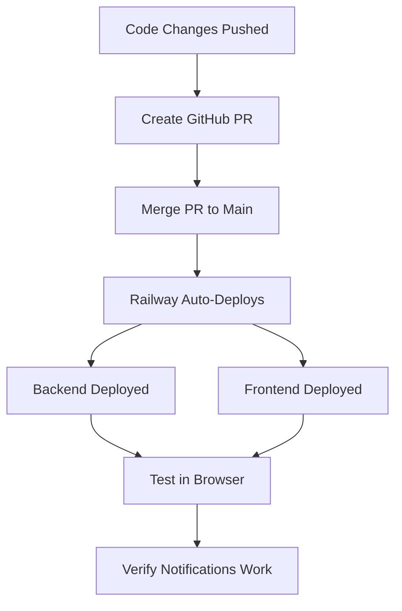

# Project Context: XChange Egypt - Barter Matching Platform

## Your Role
You are continuing development on the XChange Egypt platform, a real-time barter matching system. Previous work has been done on fixing WebSocket notifications for match alerts. You need to complete the PR creation, deployment, and testing.

---

## CRITICAL USER PREFERENCES

1. **Deployment Workflow:** Railway does NOT auto-deploy from branch pushes. You MUST create GitHub PR and merge it to trigger deployment. The user has corrected this multiple times - never assume automatic deployment.

2. **Git Workflow:**
   - Working branch: `claude/xchange-database-setup-01YZVLQXx5YDHgakAamcGGz8`
   - Always push to: `origin claude/xchange-database-setup-01YZVLQXx5YDHgakAamcGGz8`
   - Use format: `git push -u origin <branch-name>`
   - Retry on network failures: up to 4 times with exponential backoff (2s, 4s, 8s, 16s)

3. **GitHub CLI:** `gh` command is NOT available. Must use web URLs for PR creation.

4. **Communication:** User prefers direct, technical communication. No assumptions about "automatic" processes.

---

## Technical Stack

**Backend:**
- Node.js + TypeScript
- Socket.IO for WebSockets
- PostgreSQL database
- Location: `/backend/`

**Frontend:**
- Next.js 14 (App Router)
- TypeScript
- Socket.IO client
- React Context for WebSocket state
- Location: `/frontend/`

**Deployment:**
- Railway (backend + frontend)
- Requires GitHub PR merge to deploy

---

## Current Task: Fix Real-time Match Notifications

### Problem Statement
Backend correctly:
- Finds barter matches (bidirectional cycles)
- Creates notifications in database
- Emits WebSocket events to user rooms

But users weren't receiving real-time notifications because:
1. ❌ Frontend didn't send `userId` in WebSocket auth → Backend couldn't join users to rooms
2. ❌ Frontend had no event listener for `match:found` events

### Work Completed ✅

#### 1. File: `frontend/lib/contexts/SocketContext.tsx`

**Line 50-56:** Added userId to WebSocket auth
```typescript
const newSocket = io(WS_URL, {
  auth: {
    token,
    userId: user.id,  // ← ADDED THIS (Commit: 9716c24)
  },
  transports: ['websocket', 'polling'],
});
```

**Lines 16-23:** Added TypeScript interface
```typescript
interface MatchNotification {
  type: 'new_match' | 'updated_match';
  opportunityId: string;
  participantCount: number;
  averageMatchScore: number;
  participants: string[];
  timestamp: Date;
}
```

**Lines 33-34:** Added to SocketContextType
```typescript
onMatchFound: (callback: (notification: MatchNotification) => void) => void;
offMatchFound: (callback: (notification: MatchNotification) => void) => void;
```

**Lines 120-131:** Implemented event listener methods
```typescript
const onMatchFound = (callback: (notification: MatchNotification) => void) => {
  if (!socket) return;
  socket.on('match:found', callback);
  console.log('🔔 Listening for match notifications');
};

const offMatchFound = (callback: (notification: MatchNotification) => void) => {
  if (!socket) return;
  socket.off('match:found', callback);
};
```

**Lines 143-144:** Exported in provider value
```typescript
onMatchFound,
offMatchFound,
```

#### 2. File: `frontend/app/notifications/page.tsx`

**Line 7:** Import hook
```typescript
import { useSocket } from '@/lib/contexts/SocketContext';
```

**Line 19:** Destructure methods
```typescript
const { onMatchFound, offMatchFound } = useSocket();
```

**Lines 33-46:** Add event listener with cleanup
```typescript
useEffect(() => {
  const handleMatchNotification = (notification: any) => {
    console.log('🔔 Received match notification:', notification);
    loadNotifications();  // Refresh from database
  };

  onMatchFound(handleMatchNotification);

  return () => {
    offMatchFound(handleMatchNotification);
  };
}, [onMatchFound, offMatchFound]);
```

**Lines 72-76:** Add icon for notification type
```typescript
case 'BARTER_OFFER_RECEIVED':
  return '🎯';
```

#### 3. Git Commits

- **9716c24:** "fix: Add userId to WebSocket auth for notification room joining"
- **f0ddf1a:** "feat: Add real-time match notification support to frontend"

Both commits are pushed to branch `claude/xchange-database-setup-01YZVLQXx5YDHgakAamcGGz8`

---

## Backend Context (No Changes Needed)

### File: `backend/src/services/realtime-matching.service.ts`

**Lines 70-75:** Expects userId in auth (now provided by frontend)
```typescript
const userId = socket.handshake.auth?.userId;
if (userId) {
  socket.join(`user:${userId}`);
  console.log(`[RealTimeMatching] User ${userId} joined their notification room`);
}
```

**Lines 89-98:** Emits to user's room
```typescript
const notifyUser = (userId: string, notification: MatchNotification): void => {
  if (!io) {
    console.warn('[RealTimeMatching] WebSocket not initialized');
    return;
  }
  io.to(`user:${userId}`).emit('match:found', notification);
  console.log(`[RealTimeMatching] Sent notification to user ${userId}`);
};
```

**Railway Logs Confirm Backend Working:**
```
[RealTimeMatching] User 0be770c2-0c6a-46cc-967f-66ddbae5c27f joined their notification room
[RealTimeMatching] User 4c169579-b80c-4c67-b97a-51fae6553527 joined their notification room
[RealTimeMatching] Sent notification to user 0be770c2...
[RealTimeMatching] Sent 3 notifications
```

---

## IMMEDIATE NEXT STEPS

### Step 1: Verify Git Status ✅
```bash
git status
git log --oneline -3
```

**Expected:**
- Branch: `claude/xchange-database-setup-01YZVLQXx5YDHgakAamcGGz8`
- Latest commits: f0ddf1a, 9716c24

### Step 2: Create GitHub Pull Request ⏳

**PR Creation URL:**
```
https://github.com/AiSchool-Admin/xchange-egypt/compare/main...claude/xchange-database-setup-01YZVLQXx5YDHgakAamcGGz8
```

**PR Title:**
```
Fix: Add real-time WebSocket notifications for barter matches
```

**PR Description:**
```markdown
## Summary
Fixes real-time notification delivery for barter matches. Users now receive WebSocket events when matches are found.

## Problem
- Backend was creating notifications and emitting WebSocket events
- Users weren't receiving them in real-time
- Root causes:
  1. Frontend didn't send userId in socket auth → users couldn't join notification rooms
  2. Frontend had no event listener for 'match:found' events

## Solution

### 1. Added userId to WebSocket Auth
**File:** `frontend/lib/contexts/SocketContext.tsx:53`
- Now sends `userId: user.id` in socket auth
- Allows backend to join users to their notification rooms

### 2. Added Event Listener Infrastructure
**File:** `frontend/lib/contexts/SocketContext.tsx`
- Added `MatchNotification` TypeScript interface
- Implemented `onMatchFound()` and `offMatchFound()` methods
- Exported methods in SocketContext provider

### 3. Wired Up Notifications Page
**File:** `frontend/app/notifications/page.tsx:33-46`
- Added useEffect to listen for 'match:found' events
- Auto-refreshes notifications list on new match
- Proper cleanup on component unmount
- Added 🎯 icon for `BARTER_OFFER_RECEIVED` type

## Backend Evidence
Railway logs confirm backend is working correctly:
- ✅ Users joining rooms: `[RealTimeMatching] User XXX joined their notification room`
- ✅ Notifications sent: `[RealTimeMatching] Sent notification to user XXX`
- ✅ Matches found with scores: 64.7%, 68.8%, 77.5%

## Testing Plan
After PR merge and Railway deployment:

1. **Verify WebSocket Connection**
   - Login and navigate to `/notifications`
   - Open browser console (F12)
   - Should see: `✅ Socket connected` and `🔔 Listening for match notifications`

2. **Test Match Notification**
   - User A creates: "iPhone" (wants "Laptop")
   - User B creates: "Laptop" (wants "iPhone")
   - Console should show: `🔔 Received match notification: {...}`
   - Notifications page should auto-refresh
   - New notification appears with 🎯 icon

## Commits
- `9716c24` - fix: Add userId to WebSocket auth for notification room joining
- `f0ddf1a` - feat: Add real-time match notification support to frontend

## Files Changed
- `frontend/lib/contexts/SocketContext.tsx` (+27 lines)
- `frontend/app/notifications/page.tsx` (+16 lines)
```

**Action Required:**
Since `gh` CLI is not available, provide the user with the PR URL and ask them to create it manually, OR guide them through the process.

### Step 3: After PR Merge → Verify Railway Deployment

**Check Railway Dashboard:**
- Wait for deployment to complete (both backend + frontend)
- Verify no errors in build logs

### Step 4: End-to-End Testing

**Test Script:**

1. **Open Browser Console** (F12)
2. **Login** to xchange-egypt app
3. **Navigate** to `/notifications` page
4. **Verify Logs:**
   ```
   ✅ Socket connected
   🔔 Listening for match notifications
   ```

5. **Create Test Match:**
   - **User A:** Create item "iPhone 13" wanting "Laptop"
   - **User B:** Create item "MacBook Pro" wanting "iPhone"

6. **Expected Results:**
   - Backend finds bidirectional match
   - Backend emits `match:found` to both users
   - Console logs: `🔔 Received match notification: {...}`
   - Notifications page auto-refreshes
   - New notification appears with 🎯 icon and match details

7. **Check Railway Logs:**
   ```
   [RealTimeMatching] Found cycle: [user1:item1, user2:item2]
   [RealTimeMatching] Match score: 75.5%
   [RealTimeMatching] Sent notification to user XXX
   ```

---

## Key Files Reference

```
/home/user/xchange-egypt/
├── backend/
│   └── src/
│       └── services/
│           └── realtime-matching.service.ts  (WebSocket emission - NO CHANGES)
├── frontend/
│   ├── lib/
│   │   └── contexts/
│   │       └── SocketContext.tsx             (MODIFIED: userId auth + listeners)
│   └── app/
│       └── notifications/
│           └── page.tsx                      (MODIFIED: event listener + UI)
```

---

## Important Constraints

1. **Never assume automatic deployment** - Always require explicit PR merge
2. **Use exponential backoff** for git push retries on network failures
3. **Always use absolute file paths** in tool calls
4. **Check Railway logs** to verify backend/frontend deployment separately
5. **Test in browser console** - WebSocket connection is client-side

---

## Expected Workflow



---

## Success Criteria

✅ **GitHub PR created with detailed description**
✅ **PR merged to main branch**
✅ **Railway deploys both backend and frontend**
✅ **Browser console shows WebSocket connected**
✅ **Browser console shows listening for match notifications**
✅ **Creating matching items triggers real-time notification**
✅ **Notification appears in UI with 🎯 icon**
✅ **Backend logs confirm end-to-end flow**

---

## Current Git State

```bash
Branch: claude/xchange-database-setup-01YZVLQXx5YDHgakAamcGGz8
Status: Clean (all changes committed and pushed)

Recent Commits:
f0ddf1a - feat: Add real-time match notification support to frontend
9716c24 - fix: Add userId to WebSocket auth for notification room joining
5729e8c - fix: Include itemId in cycle deduplication signature

Main Branch Status: NOT merged yet (PR pending)
```

---

## IMMEDIATE ACTION REQUIRED

**Your first task:** Create the GitHub Pull Request using the URL and content provided above. Since `gh` CLI is unavailable, provide the user with clear instructions to create it via web interface, or if they prefer, you can ask if they'd like you to provide a curl command to create the PR via GitHub API (if they have a token).

After PR is created and merged, guide through Railway deployment verification and end-to-end testing.

---

## Additional Context

**Previous Session Work:**
- Fixed cycle deduplication bug (userId:itemId signature)
- Fixed bidirectional match detection
- Backend correctly finds matches with scores 64-77%
- Database notifications are created successfully
- WebSocket infrastructure exists and is working

**This Session Focus:**
- Frontend notification delivery (COMPLETED - code done)
- PR creation and merge (PENDING)
- Deployment verification (PENDING)
- End-to-end testing (PENDING)

---

**Ready to proceed with PR creation and deployment.**
